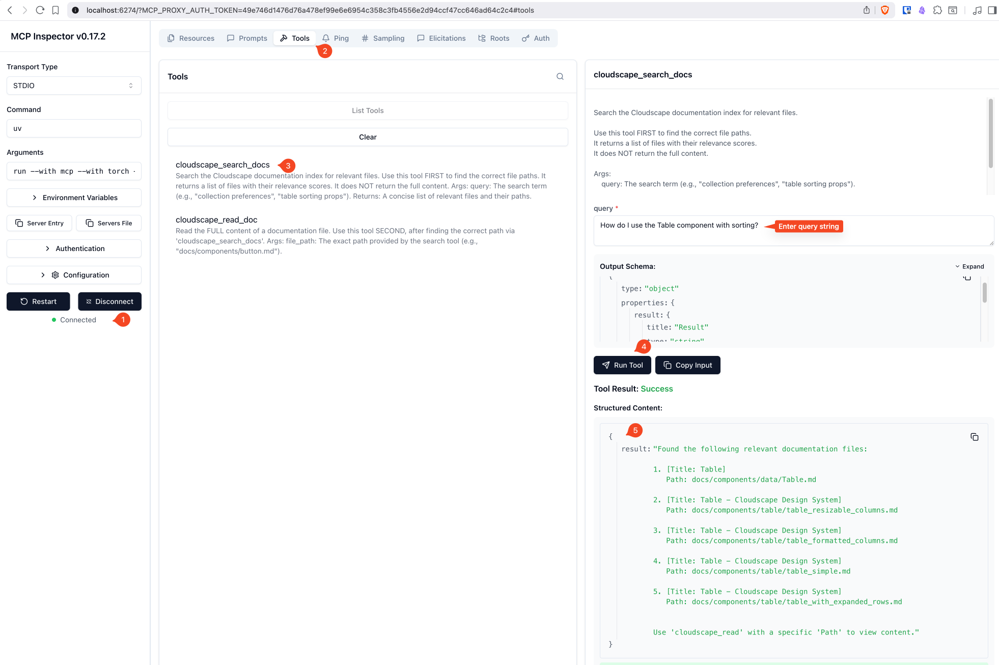

# Cloudscape Docs MCP Server

A Model Context Protocol (MCP) server that provides semantic search over AWS [Cloudscape Design](https://cloudscape.design/) System documentation. Built for AI agents and coding assistants to efficiently query component documentation.

## Features

- **Semantic Search** - Find relevant documentation using natural language queries powered by [Alibaba GTE Multilingual Base](https://huggingface.co/Alibaba-NLP/gte-multilingual-base) model
- **Token Efficient** - Returns concise file lists first, full content on demand
- **Hardware Optimized** - Automatic detection of Apple Silicon (MPS), CUDA, or CPU
- **Local Vector Store** - Uses LanceDB for fast, file-based vector search

## Transport

This server uses the MCP [stdio transport](https://modelcontextprotocol.io/specification/2025-06-18/basic/transports#stdio) protocol.\
[Streamable HTTP transport](https://modelcontextprotocol.io/specification/2025-06-18/basic/transports#streamable-http) coming soon.

## Tools

| Tool | Description |
|------|-------------|
| `cloudscape_search_docs` | Search the documentation index. Returns top 5 relevant files with titles and paths. |
| `cloudscape_read_doc` | Read the full content of a specific documentation file. |



---

## Requirements

- Python 3.13+
- ~3GB disk space for the embedding model
- 8GB+ RAM recommended

## Installation

```bash
# Clone the repository
git clone https://github.com/praveenc/cloudscape-docs-mcp.git
cd cloudscape-docs-mcp

# Create virtual environment and install dependencies
uv sync

# Or with pip
pip install -e .
```

## Setup

### 1. Add Documentation

Place your Cloudscape documentation files in the `docs/` directory. Supported formats:

- `.md` (Markdown)
- `.txt` (Plain text)
- `.tsx` / `.ts` (TypeScript/React)

### 2. Build the Index

Run the ingestion script to create the vector database:

```bash
uv run ingest.py
```

This will:

- Scan all files in `docs/`
- Chunk content into ~2000 character segments
- Generate embeddings using [Alibaba GTE Multilingual Base](https://huggingface.co/Alibaba-NLP/gte-multilingual-base) embedding model
- Store vectors in `data/lancedb/`

> **Note:** Running `uv run ingest.py` multiple times is safe but performs a **full re-index** each time. The script uses `mode="overwrite"` which drops and recreates the database table. There is no incremental update or change detection—all documents are re-scanned and re-embedded on every run. This is idempotent (same docs produce the same result) but computationally expensive for large documentation sets.

### 3. Run the Server

```bash
uv run server.py
```

## MCP Client Configuration

### Claude Desktop

Add to your `mcp.json`:

```json
{
  "mcpServers": {
    "cloudscape-docs": {
      "command": "uv",
      "args": ["run", "--directory", "/path/to/cloudscape-docs-mcp", "python", "server.py"]
    }
  }
}
```

### Cursor / VS Code / Windsurf / Kiro

Add to your MCP settings:

```json
{
  "cloudscape-docs": {
    "command": "uv",
    "args": ["run", "--directory", "/path/to/cloudscape-docs-mcp", "python", "server.py"]
  }
}
```

### Zed

Add to your Zed settings (`settings.json`):

```json
{
  "context_servers": {
    "cloudscape-docs": {
      "command": {
        "path": "uv",
        "args": ["run", "--directory", "/path/to/cloudscape-docs-mcp", "python", "server.py"]
      }
    }
  }
}
```

## Usage Example

Once connected, an AI assistant can:

1. **Search for components:**

   ```text
   User: "How do I use the Table component with sorting?"
   Agent: [calls cloudscape_search_docs("table sorting")]
   ```

2. **Read specific documentation:**

   ```text
   Agent: [calls cloudscape_read_doc("docs/components/table/sorting.md")]
   ```

## Project Structure

```text
cloudscape-docs-mcp/
├── server.py          # MCP server with search/read tools
├── ingest.py          # Documentation indexing script
├── pyproject.toml     # Project dependencies
├── docs/              # Documentation files (partially curated)
│   ├── components/    # Component documentation
│   ├── foundations/   # Design foundations
│   └── genai_patterns/# GenAI UI patterns
└── data/              # Generated vector database (gitignored)
    └── lancedb/
```

## Configuration

Key settings in `server.py` and `ingest.py`:

| Variable | Default | Description |
|----------|---------|-------------|
| `MODEL_NAME` | `Alibaba-NLP/gte-multilingual-base` | [Embedding model](https://huggingface.co/Alibaba-NLP/gte-multilingual-base) |
| `VECTOR_DIM` | `768` | Vector dimensions |
| `MAX_UNIQUE_RESULTS` | `5` | Max search results returned |
| `DOCS_DIR` | `./docs` | Documentation source directory |
| `DB_URI` | `./data/lancedb` | Vector database location |

## Development

```bash
# Install dev dependencies
uv sync --group dev

# Run with MCP inspector
npx @modelcontextprotocol/inspector uv --directory /path/to/cloudscape_docs run server.py
# Alternatively, use mcp cli to launch the server
mcp dev server.py
```

## License

MIT License - See [LICENSE](LICENSE) for details.

## Acknowledgments

- [AWS Cloudscape Design System](https://cloudscape.design/)
- [Model Context Protocol](https://modelcontextprotocol.io/)
- [Alibaba GTE Multilingual](https://huggingface.co/Alibaba-NLP/gte-multilingual-base))
- [LanceDB](https://lancedb.com/)
